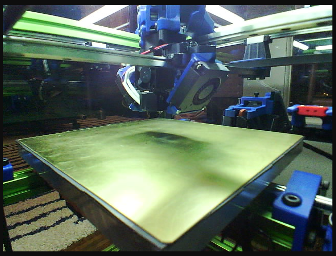
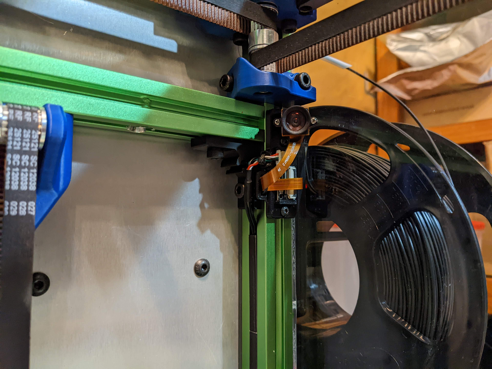
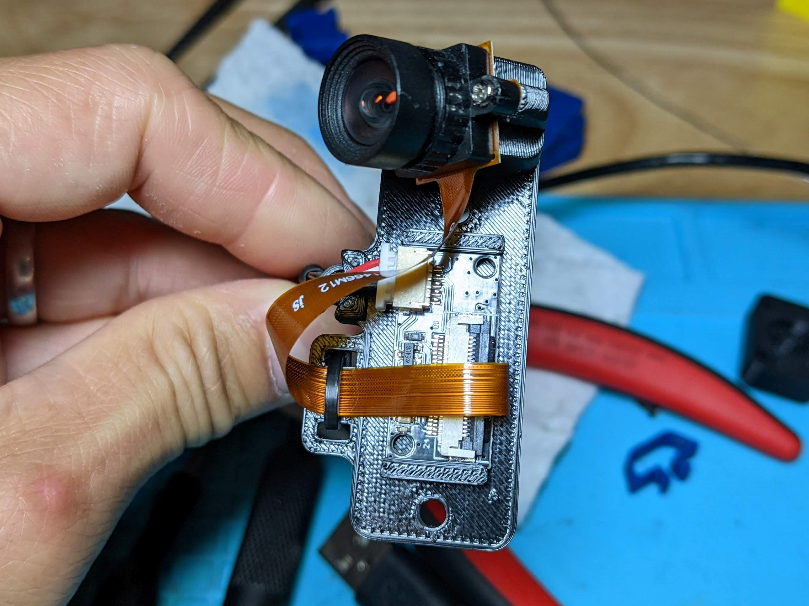
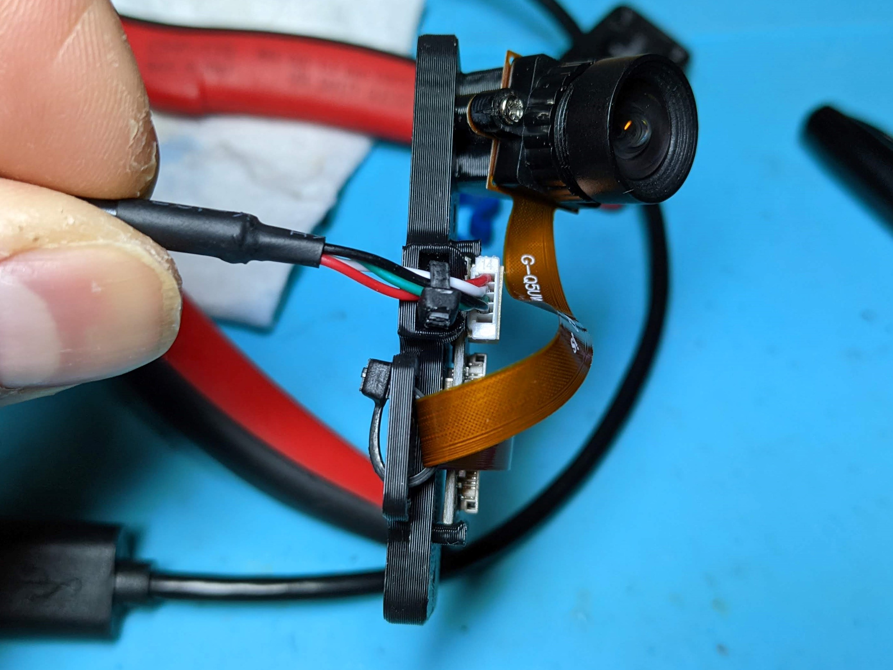
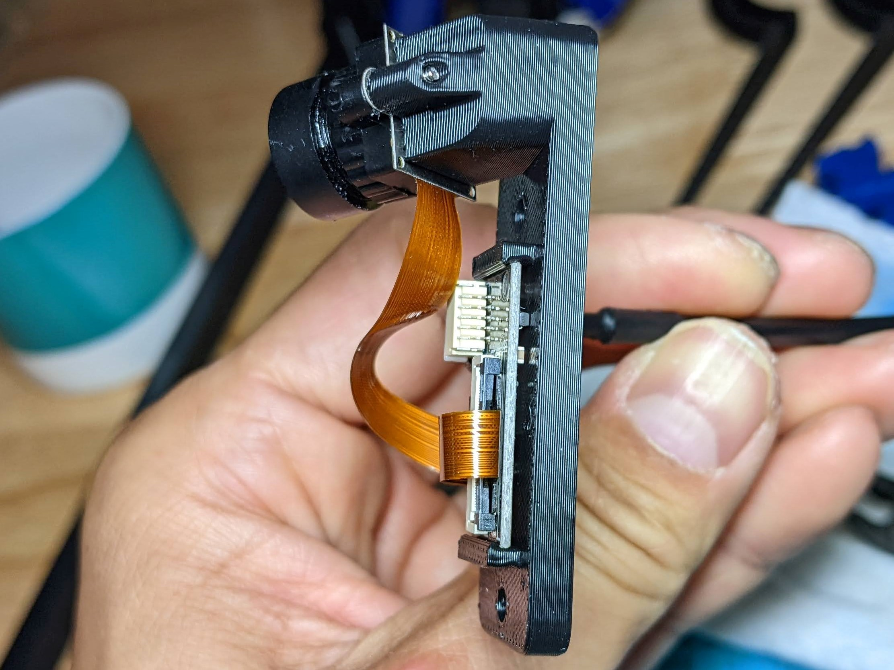
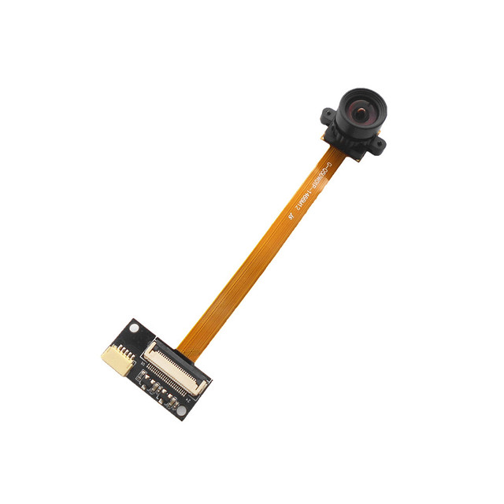

OV5640 Camera Mount
============
<table width=100%>
<TR><TD width=50% align="center"> 10 degree tilt version</TD>
<TD width=50% align="center"></TD>
</TR>
<TR><TD width=50% align="center"></TD>
<TD width=50% align="center"></TD>
</TR>
<TR><TD width=50% align="center"></TD>
<TD width=50% align="center"></TD>
</TABLE>

- **Notes**
   -   Stock Screws Version
       - Uses the screws that come with the camera (the ones that hold the sensor onto the lens)
	   - Remove the screws holding the sensor to the lens.  Place the sensor/lens apparatus onto the mount then screw in from the back of the mount.
	   - In general, use this one unless you have 1.6mm screws laying around.
	- 1.6 mm Screws Version
	   -  If you have 1.6mm screws, you can use this version and screw the 1.6mm screws in from the front of the camera directly into the plastic of the mount.
	 - I've included a 10 degree tilt and 15 degree tilt version.  This is the angle that the camera tilts down.  If you want something else, this is easily adjusted in the f3d file.
	 - Running the wires
	   - I have my panel mounted with the lower wire hole on the right (if looking from the front).  I ran the wires up the right side extrusion using included 2020_extrusion_cable_cover.stl to keep the wires in the channel.
    	- This prints standing up.  I used a brim.
    	- I found this a long time ago on voron discord, and I don't know who to credit here.  So if you know please let me know.
- **BOM**
  - OV5640 Camera 100 degree No Distortion
    - [https://www.aliexpress.com/item/2255799933896897.html](https://www.aliexpress.com/item/2255799933896897.html)
- **Acknowledgements**
  - Dr. Ghetto is the one who did the research on the cameras and worked out where to mount it.  All I did was rework his mount.  All kudos should go to him.
  
