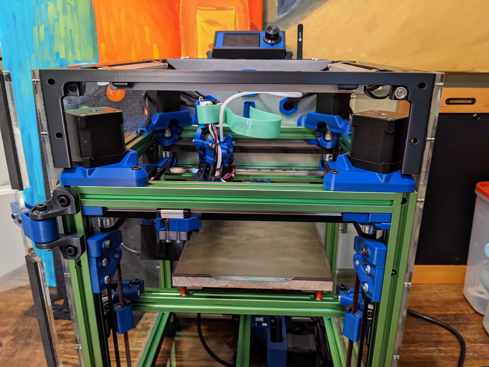
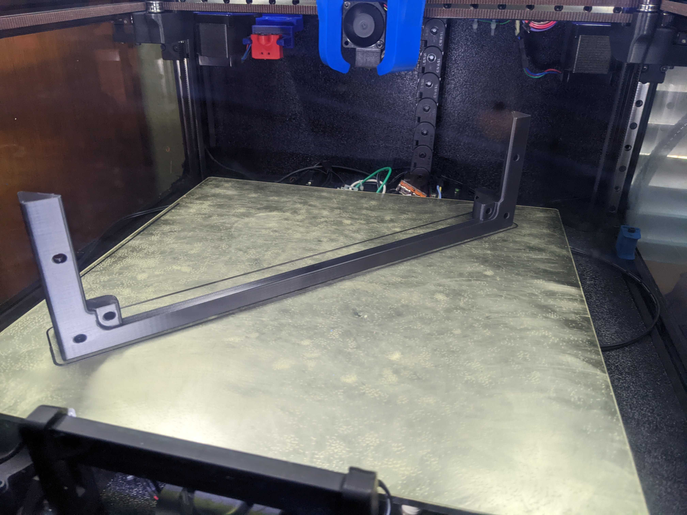

Front Door Seal (single piece tophat corners)
============
<table width=100%>
<TR><TD width=50% align="center"></TD>
<TD width=50% align="center"></TD>
</TR>
<TR><TD width=50% align="center"></TD>
<TD></TD>
</TR>
</TABLE>

- Notes
   - This allows the front door and top hat to seal against something more easily.  
   - Also included is a version that you can bolt aluminum LED channels.  I used the V style. 
     - <a href="https://www.aliexpress.com/item/2251832693313513.html">Aliexpress Link</A>
     - These further angle down the LEDs by 10 degrees (from the 45 of the V) so it points more to the center of the bed.  
     - I also made a bar to mount the same V-style LEDs on the sides.  <a href="../long-side_led_mounts/">Side LED Mounts</A>
- Printing
	 - ***Make sure to be aware of your material shrinkage!***  
	 - This is a big part (32x320mm) and even 0.58% is a decent amount of shrinkage.
  	   -  I usually scale my larger ABS parts to 100.58% in X and Y (don't usually see issues with Z shrinkage).
