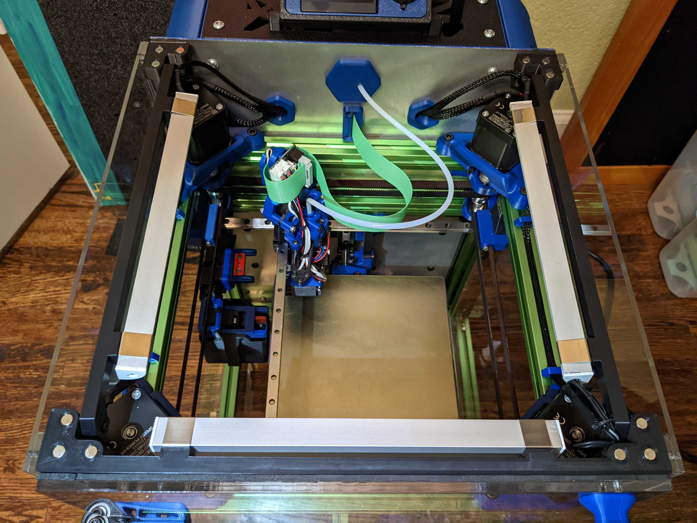
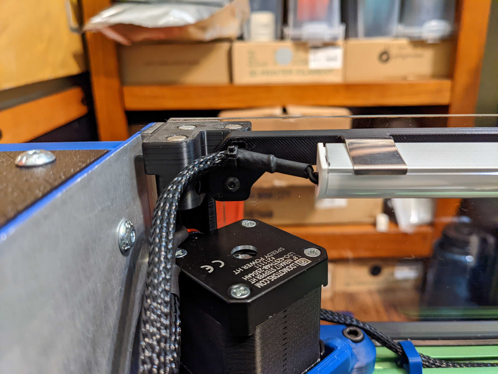
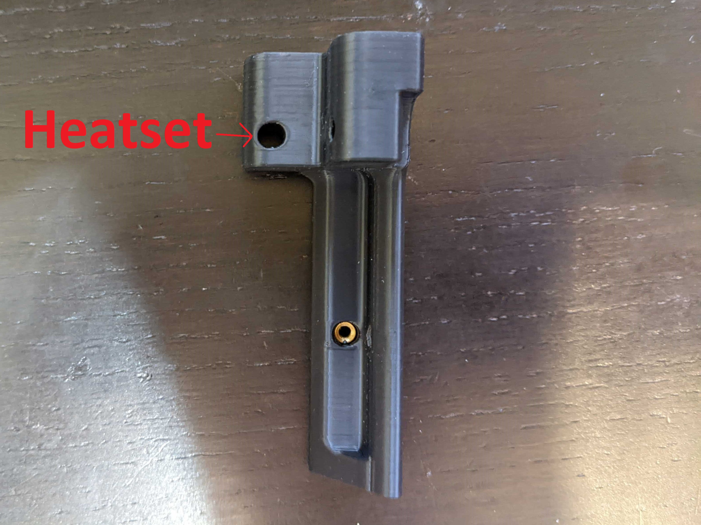

Side LED Mounts for V-Style Aluminum Brackets
============
<table width=100%>
<TR><TD width=50% align="center"></TD>
<TD width=50% align="center"></TD>
</TR>
<TR><TD width=50% align="center"></TD>
<TD></TD>
</TR>
</TABLE>

- Notes
   - Allows you to mount <a href="https://www.aliexpress.com/item/2251832693313513.html">V-Style LED Brackets</A> for your side LEDs. 
     - These further angle down the LEDs by 10 degrees (from the 45 of the V) so it points more to the center of the bed.  
     - I also made a bar to mount the same V-style LEDs on the front.  <a href="../long-front_door_seal_single_piece">front LED Mount</A>
- Printing
	 - ***Make sure to be aware of your material shrinkage!***  
	 - The holes that mount the piece into the tophat_corners are slotted, so material shrinkage shouldn't be a huge problem.    However, this is a large part, so just be aware that you may need to scale your part up.
  	 -  I usually scale my larger ABS parts to 100.58% in X and Y (don't usually see issues with Z shrinkage).
