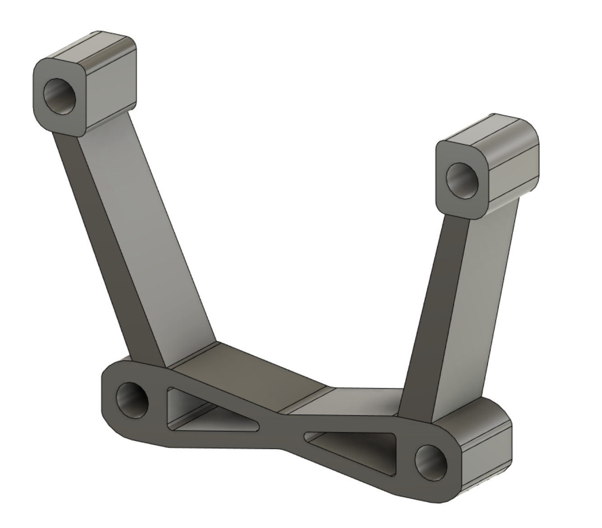
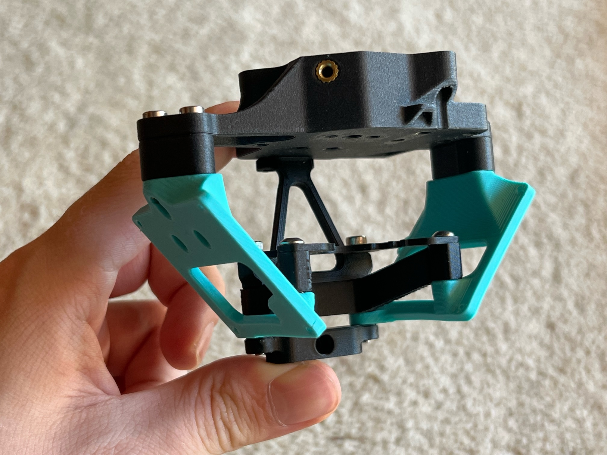

# Volcomosq Net Spacer

A spacer that allows the standard mosquito net parts to be compatible with the extended meltzone of the Volcomosq hotend.
Highly recommended to print in a rigid, temperature resistant material such as PC CF. Supports *are* required

Volcomosq specific BOM:

2x M3x16mm SBHCS/SHCS & 2x M3x25mm SBHCS/SHCS

