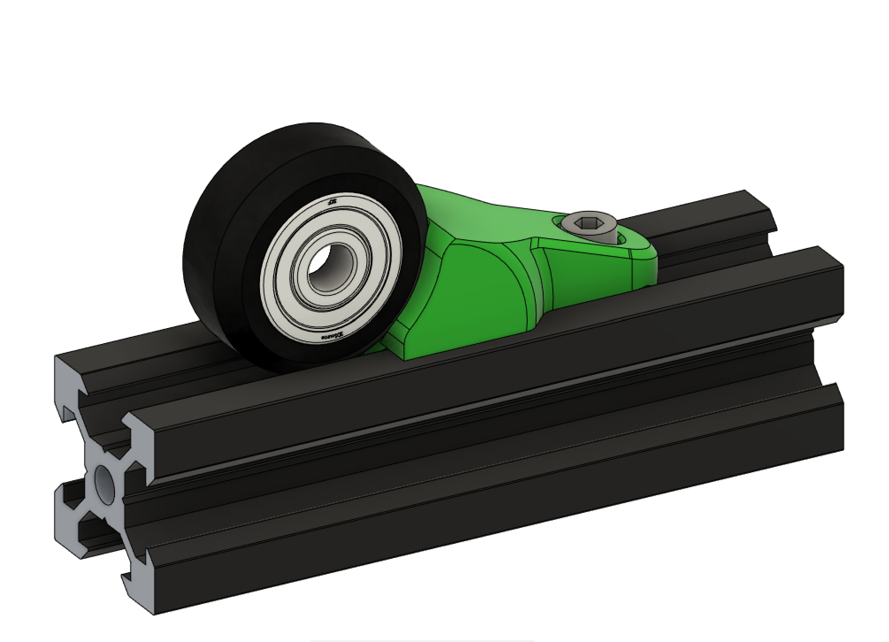
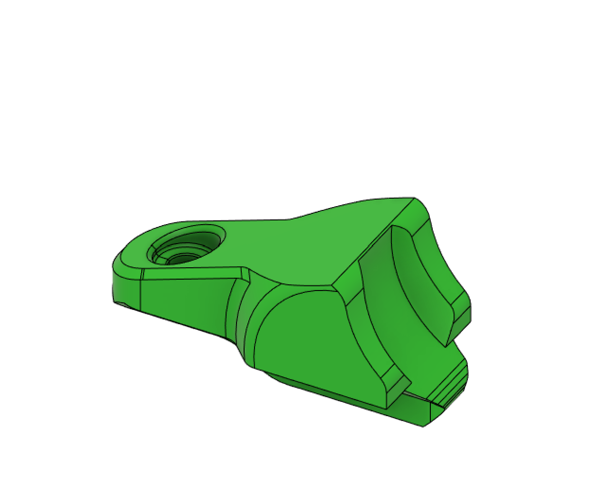
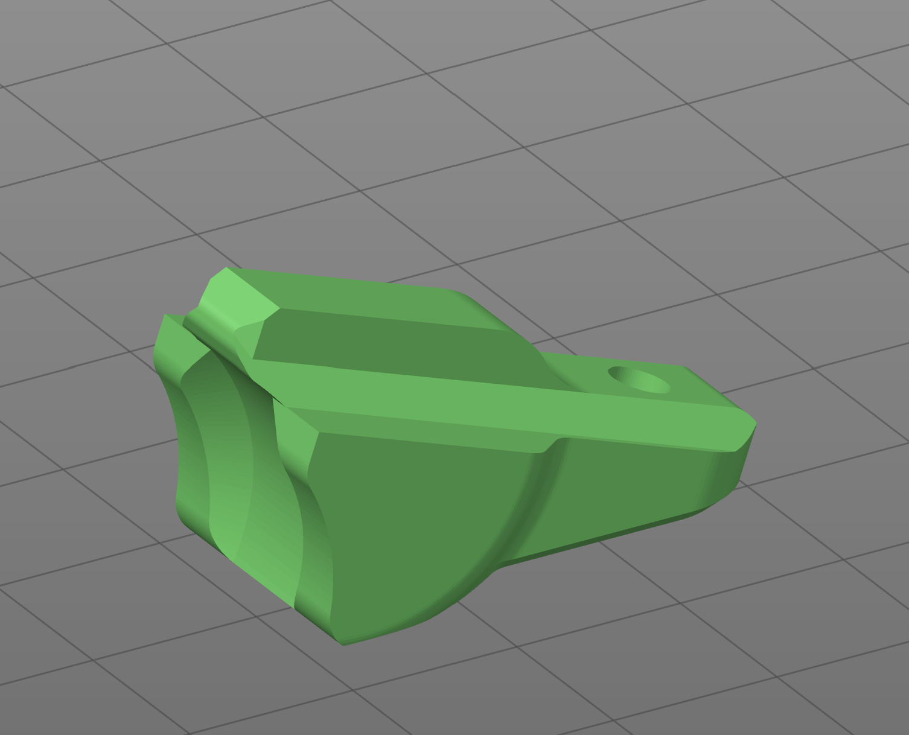

# VSlot Roller Stop - Sensorless Endstop

Like a wheel chock for a trailer, this sits in an extrusion and stop the wheels. 

It is probably not a good idea to use this for sensorless homing on the Z axis as the mechanical stresses will cause the screw to deflect and bend the carriage bracket.

It is useful as a sensorless homing endstop or simply to secure a carriage for reasons like transporting the printer.

The part requires one M3x8mm Socket Head Cap Screw and some form of T-Nut.

It should be printed in this orientation without supports and with 4 perimeters and 20% infill.