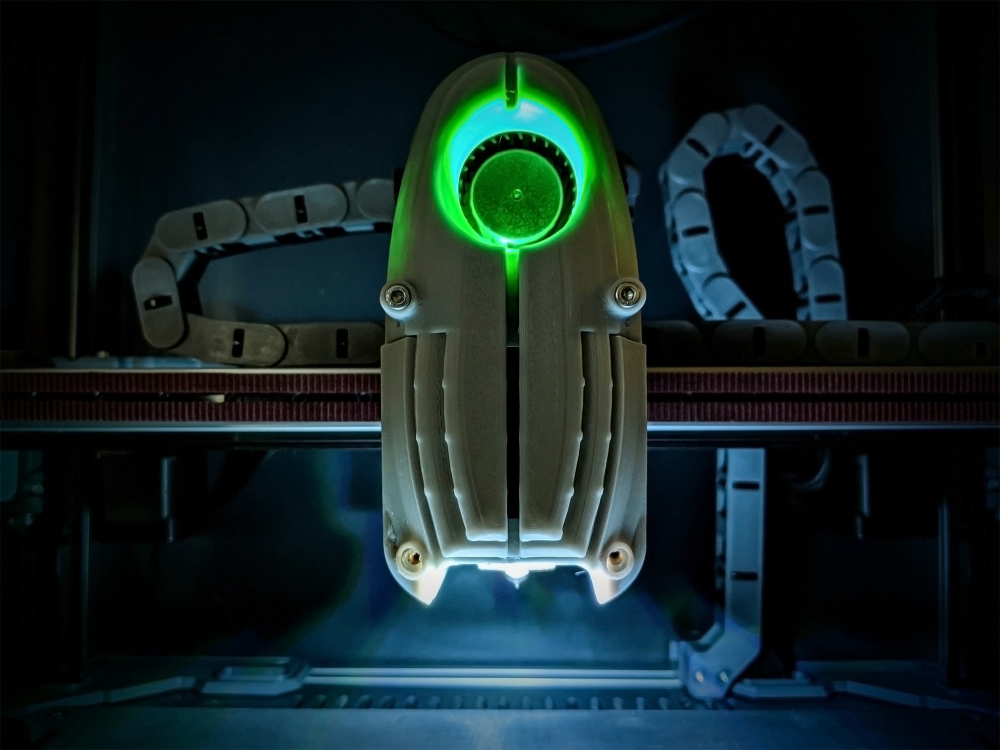
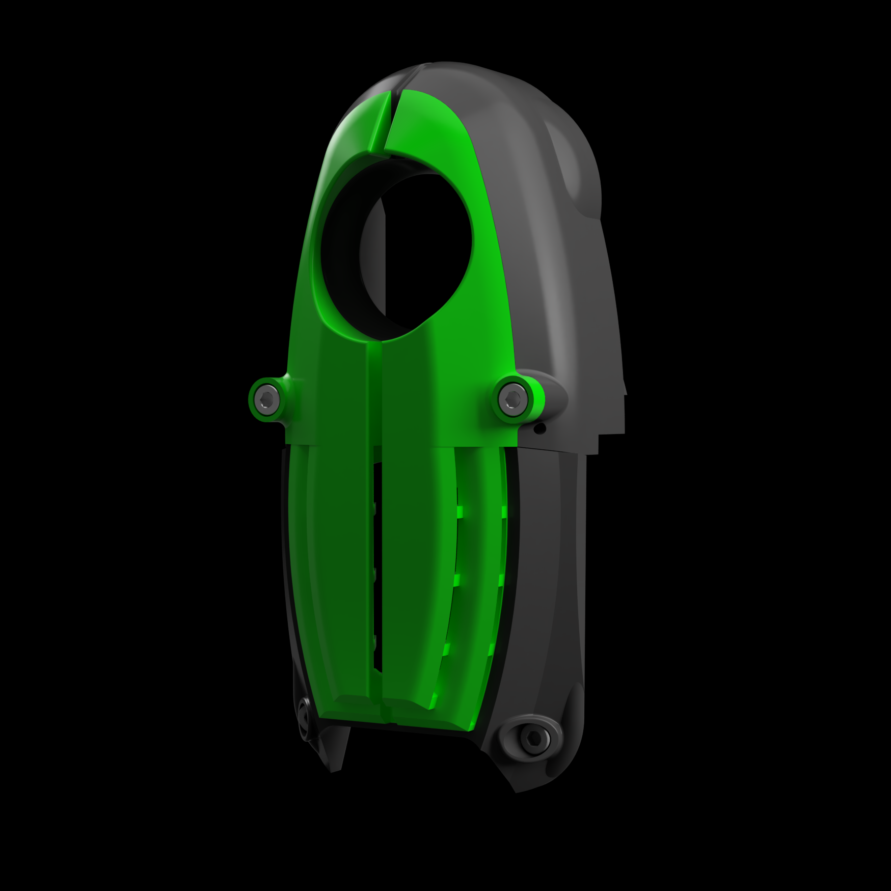
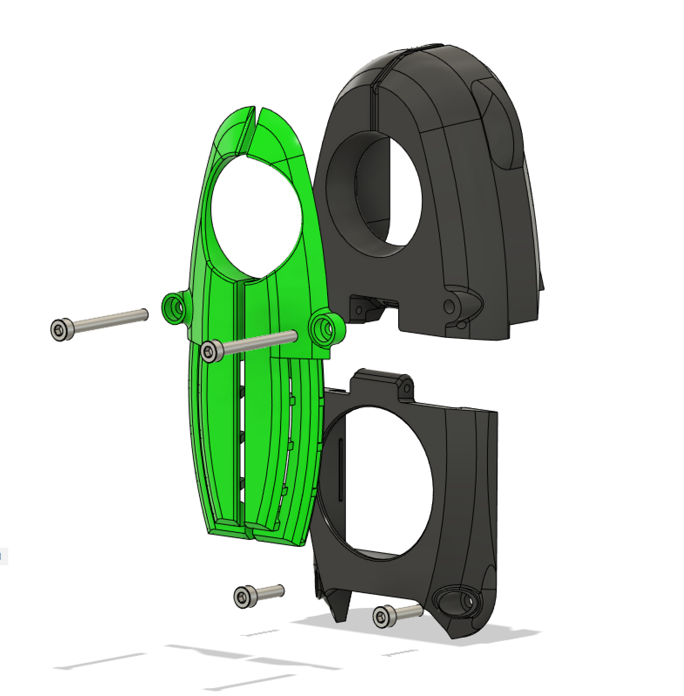
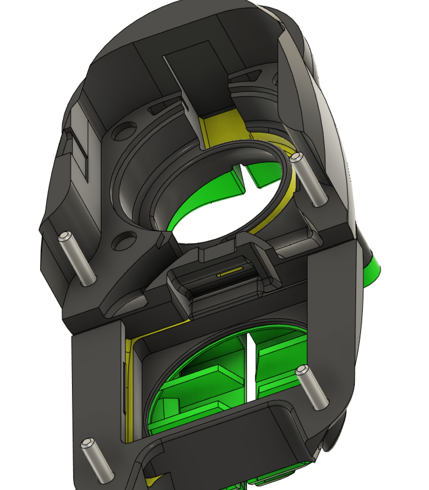
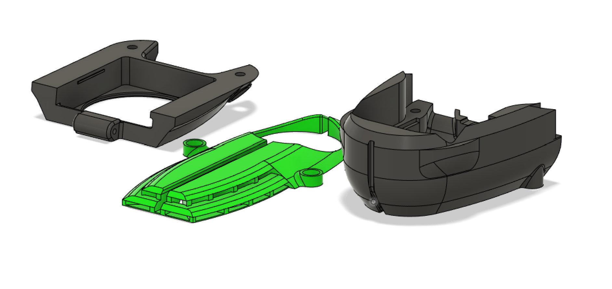

# (m)oron Afterburner Cover Thing.

(mental's voron) 

This is a super early alpha of this so use at your own risk. It replaces the stock Afterburner "Front Cover" and "Blower Casing" and adds a fan grill that mounts on the stock screw holes using stock screw lengths.

Disclaimers:
The front grill probably doesn't supply enough air. I have had some heat creep issues with it with my mosquito when printing ABS and PETG with a higher than ambient chamber temperature. You may have better luck with it. There have also been reports that the grill collides with the front door on a standard Voron. Since this was designed for the (m)oron then I am sorry. I will try to release a version that is about 5mm thinner in the near future along with optimal geometry. Read: Bigger holes.

If you wish to add SMD LEDs to the blower casing part, it was designed for the strips that have a density of 144 LEDs/M because that is what I had lying around. It may work with the 60 LEDs per meter density strips as well. There are wire channels around the interior of the parts that should allow for 3 26-28 gauge wires to be routed to drive the LEDs.

Message me on discord if you have any trouble with the wiring and firmware settings for addressable LEDs.

Print orientation.

