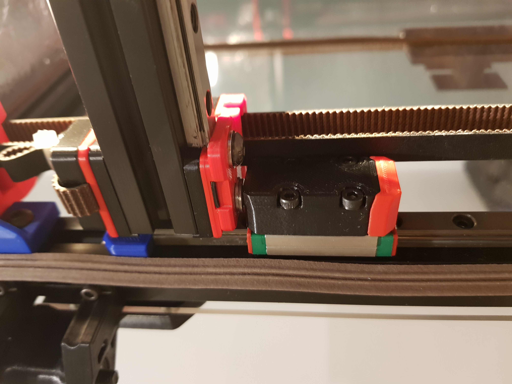

# Reinforced Gantry Mounts for Redbout (V2.2 and V2.4 Compatible)

This new z joint has been developed for Redoubt but is backwards compatible with V2.2 and V2.4. The main advantage being that the gantry is now 13mm closer to the linear rails. Internal testing has shown that there is a noticeable improvement being less ringing for the Y axis. The ball head screw also allows the gantry to move smoothly in the printed part in comparison to the old design where layer lines rubbed each other. The pre-tensioning mechanism allows you to have zero play in the joint. The belt clips don’t have to come loose to swap the z joint and lastly due to its compact size full travel of the linear rails is possible. Compatible with a 0.6 nozzle and 0.3LH.

Note: The z joint is too far away to hit the y limit switch. A spacer is included in the STls (mount on the lower half of the z block with 2x M3x20 bolts). You can also opt to use sensorless homing.

Parts: 
* 4x 02152 ball head screws
* 16x DIN912 M3x12
* 8x DIN912 M3x16
* 4x 1mm M5 washer

Tools:
* 4mm Allen Key (to tighten the set screws)

