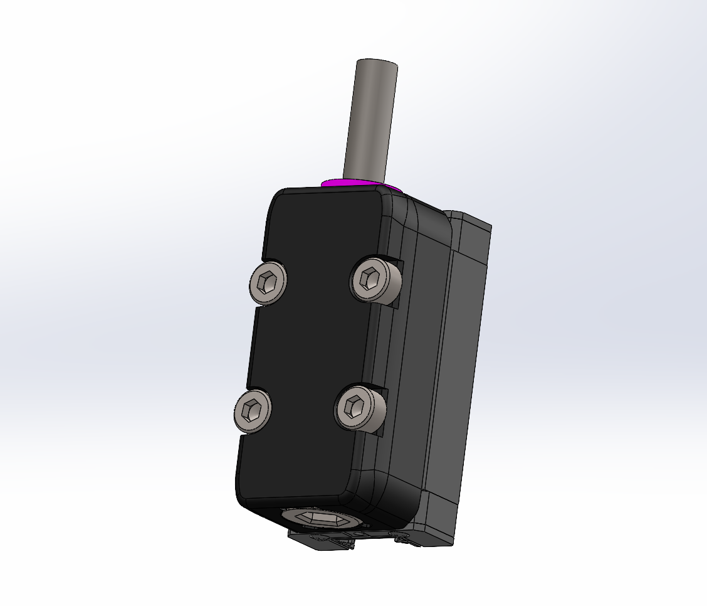
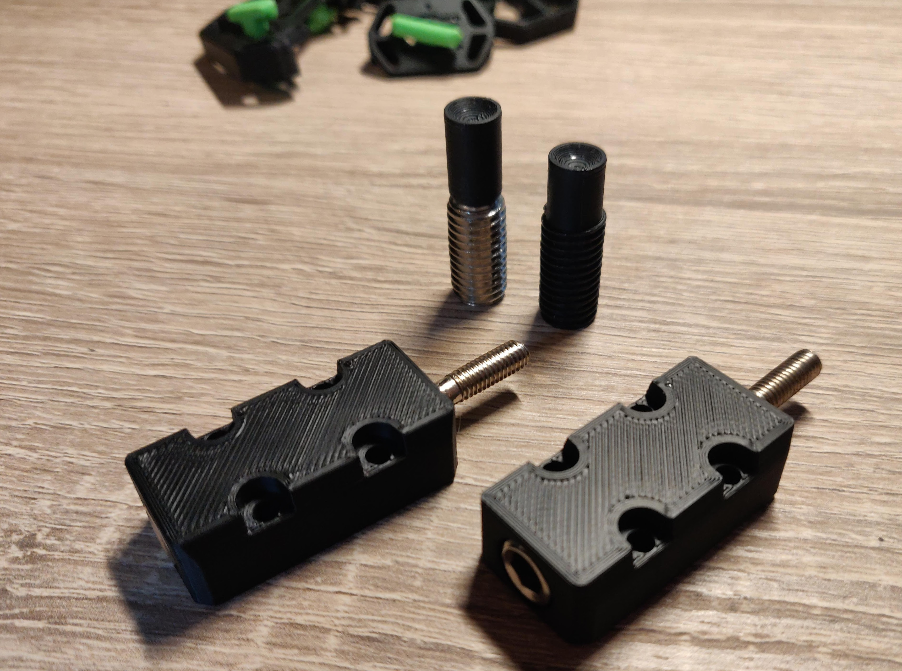
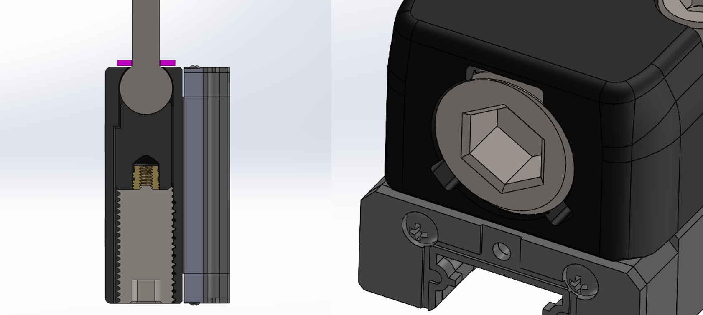

## Reinforced gantry mounts

## What is it?
This new z joint has been developed for Redoubt but is backwards compatible with V2.2 and V2.4. The main advantage being that the gantry is now 13mm closer to the linear rails. Internal testing has shown that there is a noticeable improvement and less ringing for the Y axis. The ball head screw also allows the gantry to move smoothly in the printed part in comparison to the old design where layer lines rubbed each other. The pre-tensioning mechanism allows you to have zero play in the joint. The belt clips don’t have to come loose to swap the z joint and lastly due to its compact size full travel of the linear rails is possible. Compatible with a 0.6 nozzle and 0.3LH.

For more pictures see the folder

## Changes from revision 1:

People had problems where the plastic hex hole didnt work anymore. Discord user Newb suggested using a metal grub screw. This should be more durable. You should not need to tighten it further then flush. Don't overtighten or you will split the block apart.

Both hallefect and microswitch endstops are supported. See the stl folder for which spacer you need.

## Changes from revision 2:

To avoid overtensioning fins have been added that will limit the force and keep the block undamaged. Furthermore an insert has been added to the spacer so that it can be pulled with a long screw if one manages to get it stuck.

## Parts needed
- 4x 02152 ball head screws
- 4x DIN913/ISO4026 M10x20 (flat end)
- 16x DIN912 M3x12
- 4x DIN912 M3x16
- 4x 1mm M5 washer
- 2x DIN912 M3x20 (optional for spacer)

## Discord
Do you have any design suggestions or ideas? We would love to hear! You can join us at https://discord.gg/MzTR3zE

