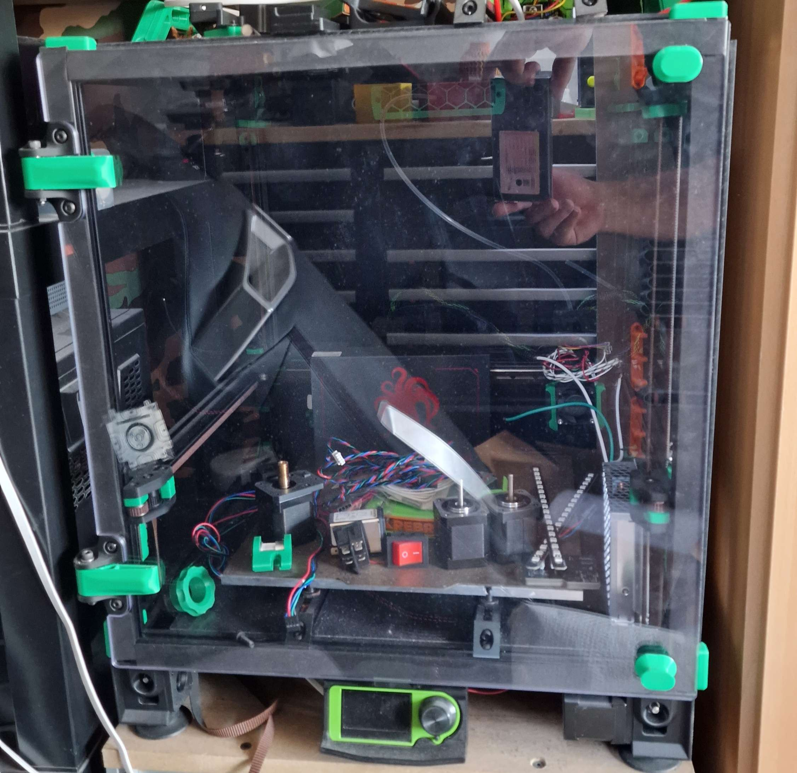

BOM
- 6mm panel
- K3 hinges (and everything needed for those [K3-door])
- the mirrored door catch
- 20mm wide 3mm tick foam tape

[K3-door]: <https://github.com/Annex-Engineering/Gasherbrum-K3/tree/main/Release_1_1/STLs/Summit_Enclosure/Front_Panel_Hinges_and_Locks>